# Policy Compliance Checker

> A schema-agnostic policy evaluation engine that works with ANY data structure - no predefined schemas required.

[](https://www.python.org/)
[](https://fastapi.tiangolo.com/)
[](https://reactjs.org/)
[](https://www.typescriptlang.org/)

---

## 🎯 Problem Statement

Traditional policy engines face critical limitations:
- 🔒 **Schema Lock-in**: Require predefined data schemas
- 🔧 **Code Changes**: Each new use case needs code modifications
- 🏢 **Domain-Specific**: Not flexible across HR, Finance, Security, etc.

## 💡 Solution

A **schema-agnostic evaluation engine** that:
- ✅ Discovers data structure at runtime
- ✅ Zero configuration required
- ✅ Works across any domain (HR, finance, security, etc.)
- ✅ Supports 100+ operator aliases
- ✅ Handles nested data structures automatically

---

## 🏗️ System Design & Architecture

```mermaid
flowchart TB
    subgraph Problem["🎯 PROBLEM DEFINITION"]
        P1["Traditional policy engines need predefined schemas"]
        P2["Code changes required for each new use case"]
        P3["Not flexible across domains HR, Finance, Security"]
    end

    subgraph Solution["💡 SOLUTION DESIGN"]
        S1["Schema-agnostic evaluation engine"]
        S2["Runtime structure discovery"]
        S3["Configuration-driven behavior"]
    end

    subgraph Architecture["🏗️ ARCHITECTURE LAYERS"]
        direction TB

        subgraph Frontend["Frontend Layer - React + TypeScript"]
            F1["PolicyUpload Component"]
            F2["UserUpload Component"]
            F3["Results Display"]
            F4["API Client Axios"]
        end

        subgraph Backend["Backend Layer - FastAPI + Python"]
            direction LR

            subgraph API["API Routes"]
                R1["/api/evaluate"]
                R2["/api/policies/upload"]
                R3["/api/users/upload"]
            end

            subgraph Services["Core Services"]
                direction TB
                SV1["FileParser<br/>Parse CSV/JSON<br/>Type conversion"]
                SV2["Normalizer<br/>Wrapper detection<br/>Heuristic finding"]
                SV3["DynamicRuleEvaluator<br/>Recursive tree walk<br/>Operator mapping"]
            end
        end

        subgraph Data["Data Layer - SQLite"]
            DB1[("Policy<br/>raw JSON")]
            DB2[("UserData<br/>raw JSON")]
            DB3[("EvaluationResult<br/>passed + details")]
        end
    end

    subgraph Flow["🔄 EXECUTION FLOW"]
        direction LR
        Step1["1. Upload<br/>Files"] --> Step2["2. Parse<br/>CSV/JSON"]
        Step2 --> Step3["3. Normalize<br/>Find arrays"]
        Step3 --> Step4["4. Evaluate<br/>Run rules"]
        Step4 --> Step5["5. Store<br/>Results"]
        Step5 --> Step6["6. Display<br/>Pass/Fail"]
    end

    subgraph Core["🧠 CORE INNOVATION - The Evaluator"]
        direction TB

        E1["Dynamic Key Discovery<br/>field/op/value → found at runtime"]
        E2["Operator Normalization<br/>greater_than → >, at_least → >="]
        E3["Nested Field Support<br/>security.mfa_enabled → drill down"]
        E4["Logical Operators<br/>allOf AND, anyOf OR, not NEGATION"]
        E5["Safe Evaluation<br/>No eval - predefined functions only"]

        E1 --> E2 --> E3 --> E4 --> E5
    end

    subgraph Design["🎨 DESIGN PRINCIPLES"]
        DP1["Separation of Concerns<br/>API → Service → Data"]
        DP2["Open/Closed Principle<br/>Add operators via config"]
        DP3["Fail-Safe Defaults<br/>Wrapper → Heuristic → Single item"]
        DP4["Configuration Over Code<br/>Environment variables"]
    end

    Problem --> Solution
    Solution --> Architecture

    F1 & F2 & F3 --> F4
    F4 <==>|REST API| API

    API --> Services
    SV1 --> SV2
    SV2 --> SV3

    Services --> Data

    Architecture --> Flow
    Flow --> Core
    Core -.->|Implements| Design

    style Problem fill:#ffcccc
    style Solution fill:#ccffcc
    style Core fill:#ffffcc
    style Design fill:#ccccff
    style Services fill:#ffddaa
```



---

## 🚀 Quick Start

### Prerequisites
- Python 3.9+
- Node.js 16+
- Docker (optional)

### Option 1: Docker (Recommended)

```bash
# Clone the repository
git clone https://github.com/yourusername/policy-compliance-checker.git
cd policy-compliance-checker

# Start with Docker Compose
docker-compose up

# Access the application
# Frontend: http://localhost:3000
# Backend API: http://localhost:8000
# API Docs: http://localhost:8000/docs
```

### Option 2: Local Development

**Backend:**
```bash
cd backend
python -m venv venv
source venv/bin/activate  # Windows: venv\Scripts\activate
pip install -r requirements.txt
uvicorn app.main:app --reload
```

**Frontend:**
```bash
cd frontend
npm install
npm start
```

---

## 💻 Usage Example

### 1. Create a Policy File (policy.json)

```json
{
  "policies": [
    {
      "name": "Age Requirement",
      "allOf": [
        {"field": "age", "op": ">=", "value": 18},
        {"field": "status", "op": "==", "value": "active"}
      ]
    }
  ]
}
```

### 2. Create User Data (users.csv)

```csv
user_id,age,status
john@example.com,25,active
jane@example.com,16,active
bob@example.com,30,inactive
```

### 3. Upload & Evaluate

1. Upload `policy.json` via the Policy Upload tab
2. Upload `users.csv` via the User Upload tab
3. Click "Evaluate"
4. View results:

| User              | Policy           | Result |
|-------------------|------------------|--------|
| john@example.com  | Age Requirement  | ✅ Pass |
| jane@example.com  | Age Requirement  | ❌ Fail |
| bob@example.com   | Age Requirement  | ❌ Fail |

---

## 🧠 Core Features

### 1. Schema-Agnostic Design

Works with **any** JSON or CSV structure:

```json
// Structure 1 (HR)
{"policies": [...], "users": [...]}

// Structure 2 (Finance)
{"rules": [...], "data": [...]}

// Structure 3 (Custom)
{"checks": [...], "records": [...]}

// All work without code changes!
```

### 2. Flexible Operator Support

100+ operator aliases supported:

| Operator Type | Examples |
|---------------|----------|
| Comparison    | `>`, `<`, `>=`, `<=`, `==`, `!=` |
| Natural Lang  | `greater_than`, `less_than`, `at_least`, `at_most` |
| Containment   | `in`, `not_in`, `contains`, `contains_any` |
| String        | `starts_with`, `ends_with`, `regex` |
| Existence     | `exists`, `not_exists`, `is_empty` |

### 3. Nested Data Support

Use dot notation for nested fields:

```json
// Policy
{"field": "security.mfa_enabled", "op": "==", "value": true}

// User data
{"user_id": "john", "security": {"mfa_enabled": true}}

// Result: ✅ Pass
```

### 4. Logical Operators

Complex rule combinations:

```json
{
  "allOf": [  // AND logic
    {"field": "age", "op": ">=", "value": 18},
    {"anyOf": [  // OR logic
      {"field": "role", "op": "==", "value": "Manager"},
      {"field": "level", "op": "==", "value": "Senior"}
    ]}
  ]
}
```

### 5. Implicit Conditions

Simplified syntax:

```json
// Instead of:
{"field": "department", "op": "==", "value": "Engineering"}

// Write:
{"department": "Engineering"}
```

---

## 📁 Project Structure

```
Policy-Compliance-Checker/
├── backend/
│   ├── app/
│   │   ├── api/
│   │   │   └── routes.py              # API endpoints & orchestration
│   │   ├── core/
│   │   │   ├── config.py              # Configuration management
│   │   │   └── database.py            # Database setup
│   │   ├── models/
│   │   │   └── policy.py              # SQLAlchemy models
│   │   ├── services/
│   │   │   ├── evaluator.py           # ⭐ Core evaluation engine
│   │   │   └── file_parser.py         # CSV/JSON parsing
│   │   └── main.py                    # FastAPI application
│   ├── Dockerfile
│   └── requirements.txt
├── frontend/
│   ├── src/
│   │   ├── components/
│   │   │   ├── PolicyUpload.tsx
│   │   │   ├── UserUpload.tsx
│   │   │   └── Results.tsx
│   │   ├── services/
│   │   │   └── api.ts                 # API client
│   │   └── types/
│   │       └── index.ts               # TypeScript types
│   └── package.json
├── test-data/                          # 17 test structure variations
├── docker-compose.yml
├── .env.example
└── README.md
```

---

## 🎨 Design Principles

### 1. Separation of Concerns
```
┌──────────────┬────────────────────────────────┐
│ Layer        │ Responsibility                 │
├──────────────┼────────────────────────────────┤
│ Presentation │ UI/UX, user interaction        │
│ API          │ Request routing, orchestration │
│ Service      │ Business logic, evaluation     │
│ Data Access  │ Persistence, retrieval         │
└──────────────┴────────────────────────────────┘
```

### 2. Open/Closed Principle
- Open for extension (add new operators via config)
- Closed for modification (no code changes needed)

### 3. Fail-Safe Defaults
```
Policy Detection Strategy:
1. Check explicit wrapper keys (highest priority)
2. Heuristic detection (find largest array)
3. Treat as single item (safe default)
```

### 4. Configuration Over Code
```bash
# .env configuration
POLICY_WRAPPER_KEYS=policies,rules,checks
USER_WRAPPER_KEYS=users,data,records
ENABLE_HEURISTIC_DETECTION=true
```

---

## 🧪 Test Data Structures

The system includes **17 test structures** demonstrating flexibility:

| Structure | Purpose |
|-----------|---------|
| structure1-hr | Basic HR policies (age, department, salary) |
| structure2-finance | Financial transactions with different key names |
| structure3-security | Security policies with nested fields |
| structure4-custom | Custom wrapper keys |
| structure5-heuristic | Heuristic array detection |
| structure6-implicit | Implicit equality conditions |
| structure7-natural-lang | Natural language operators |
| structure8-deep-nest | Deeply nested structures |
| structure9-json-schema | JSON Schema-like structures |
| structure10-datetime | DateTime comparisons |
| structure11-contains | Contains_any operator |
| structure12-delimiter | Delimiter precedence |
| structure13-truthiness | Boolean coercion |
| structure14-nested-csv | CSV nested objects |
| structure15-wrapper | Wrapper normalization |
| structure16-exists | Existence checks |
| structure17-regex | Regex patterns |

---

## 🔧 Configuration

### Environment Variables

Create a `.env` file in the backend directory:

```bash
# Database
DATABASE_URL=sqlite:///./policy_compliance.db

# Structure Detection
POLICY_WRAPPER_KEYS=policies,rules,checks,requirements,constraints
USER_WRAPPER_KEYS=users,data,records,items,entries,people
ENABLE_HEURISTIC_DETECTION=true
MIN_HEURISTIC_ARRAY_SIZE=1

# Label Extraction
USER_LABEL_KEYS=user_id,id,email,username,name,first_name
POLICY_LABEL_KEYS=name,title,id,policy,policy_id,policy_name

# CORS
CORS_ORIGINS=http://localhost:3000,http://localhost:5173
```

---

## 📊 API Documentation

Once the backend is running, access interactive API docs:

- **Swagger UI**: http://localhost:8000/docs
- **ReDoc**: http://localhost:8000/redoc

### Key Endpoints

| Method | Endpoint | Description |
|--------|----------|-------------|
| POST | `/api/policies/upload` | Upload policy JSON file |
| POST | `/api/users/upload` | Upload user CSV/JSON file |
| POST | `/api/evaluate` | Upload and evaluate files directly |
| POST | `/api/evaluate/ids` | Evaluate by database IDs |
| GET | `/api/results` | Get evaluation results |
| GET | `/api/policies` | List all policies |
| GET | `/api/users` | List all user data |

---

## 🚀 Scalability Considerations

### Current Architecture (MVP)
```
Single Server
├── FastAPI (async)
├── SQLite (embedded)
└── React SPA
```
**Handles**: 100s of users, 1000s of evaluations

### Future Scaling Path
```
Load Balancer
├── API Server 1
├── API Server 2
└── API Server 3
    ↓
PostgreSQL (primary + replicas)
    ↓
Redis (caching)
    ↓
Background Workers (Celery)
```

**Scaling Enablers Already Built-in:**
- ✅ Stateless API (horizontal scaling ready)
- ✅ SQLAlchemy ORM (database-agnostic)
- ✅ Async FastAPI (concurrent requests)
- ✅ Service layer separation (microservices ready)

---

## 🔐 Security Features

1. **No Code Execution**: No `eval()` - all operators are predefined functions
2. **Input Validation**: FastAPI automatic validation with Pydantic
3. **Type Safety**: TypeScript on frontend, type hints on backend
4. **CORS Configuration**: Configurable allowed origins
5. **SQL Injection Protection**: SQLAlchemy ORM with parameterized queries

---

## 🛣️ Roadmap

### Phase 1 (Current) ✅
- [x] Schema-agnostic evaluation
- [x] 100+ operator support
- [x] Nested data handling
- [x] Web UI

### Phase 2 (Next)
- [ ] Result caching
- [ ] Batch evaluation API
- [ ] Policy builder UI
- [ ] Export reports (PDF/Excel)

### Phase 3 (Scale)
- [ ] Multi-tenancy
- [ ] Background processing
- [ ] PostgreSQL migration
- [ ] Microservices architecture

### Phase 4 (Enterprise)
- [ ] Policy marketplace
- [ ] AI-assisted policy generation
- [ ] Compliance templates
- [ ] Integration APIs (Slack, Teams)

---

## 🤝 Contributing

Contributions are welcome! Please feel free to submit a Pull Request.

1. Fork the repository
2. Create your feature branch (`git checkout -b feature/AmazingFeature`)
3. Commit your changes (`git commit -m 'Add some AmazingFeature'`)
4. Push to the branch (`git push origin feature/AmazingFeature`)
5. Open a Pull Request

---

## 📝 License

This project is licensed under the MIT License - see the LICENSE file for details.

---

## 🙏 Acknowledgments

- Built with [FastAPI](https://fastapi.tiangolo.com/)
- UI powered by [React](https://reactjs.org/)
- Type safety with [TypeScript](https://www.typescriptlang.org/)

---

## 📧 Contact

Your Name - [@yourtwitter](https://twitter.com/yourtwitter) - your.email@example.com

Project Link: [https://github.com/yourusername/policy-compliance-checker](https://github.com/yourusername/policy-compliance-checker)

---

**Made with ❤️ by a Senior Software Engineer**
